# **Product Management Service**

---

A service that handles all the Rest API calls on products and warehouse data.

---

### Tech Stack
1. Java
2. Spring-Boot
3. Spring-Data-Jpa
4. H2-InMemory-Database
5. Swagger 3

---

### Rest API Calls

> **Get Request="/products/all"**

Request to get all the product details from the table.

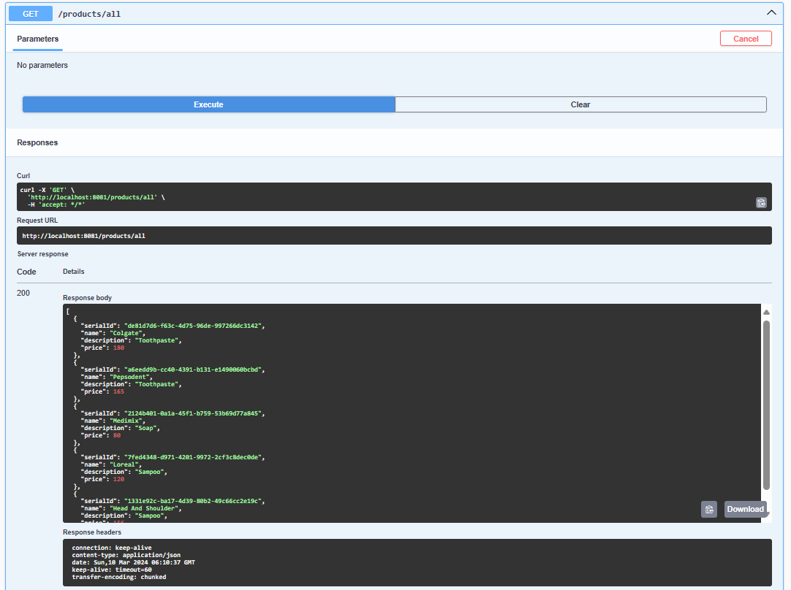

> ** Get Request="/products/{id}" **

Request to get a specific product detail by Id from the table.

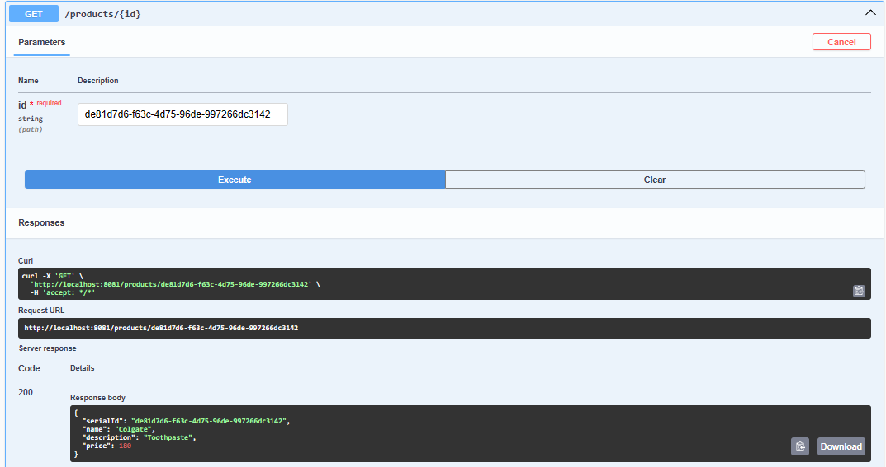

> ** Post Request="/products/product" **

Request to create product in the table.

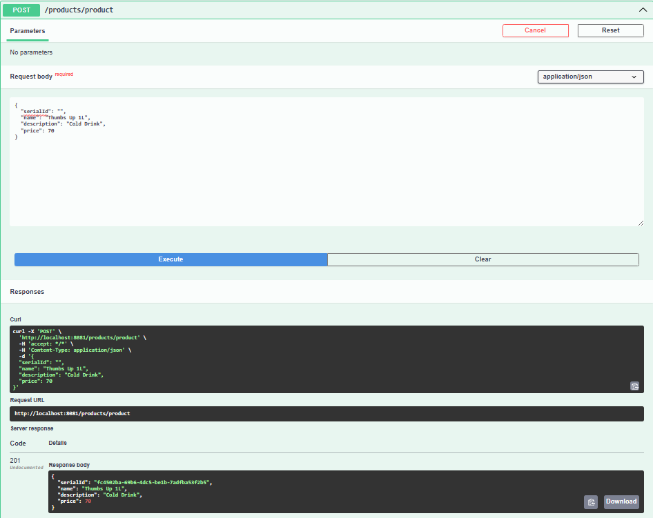

> ** Put Request="/users/{id}" **

Request to update product in the table.

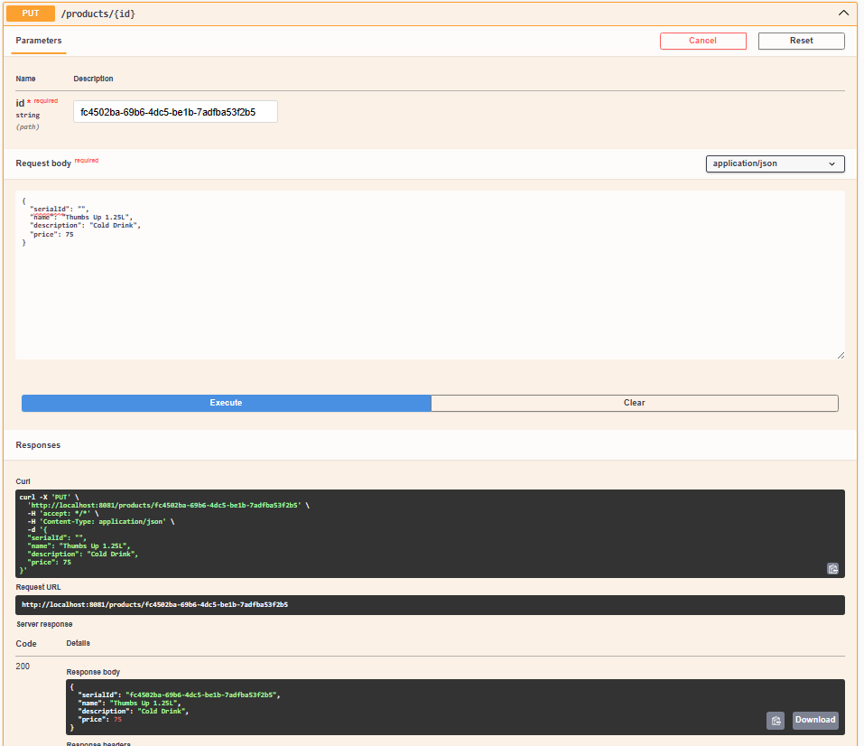

> **Delete Request="/users/{id}" **

Request to delete a specific product in the table.

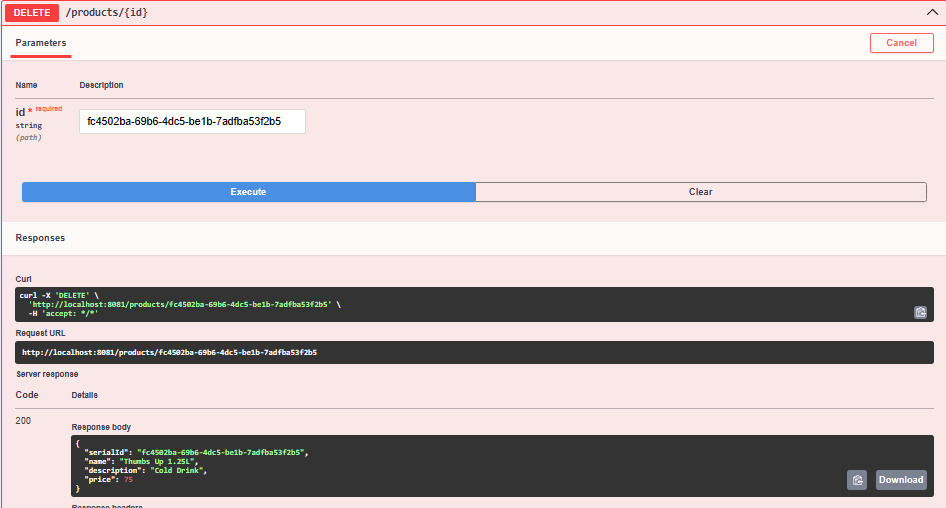

> **Get Request="/warehouse/stocks" **

Request to get all warehouse details in the table.

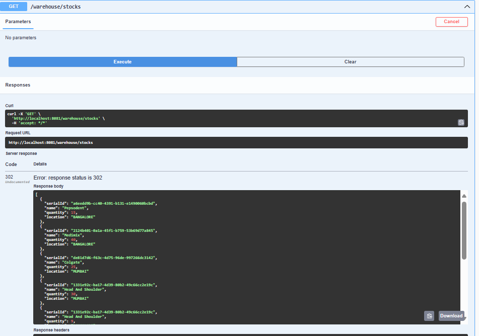

> **Get Request="/warehouse/{id}" **

Request to get product stock deatils in different warehouse location details.

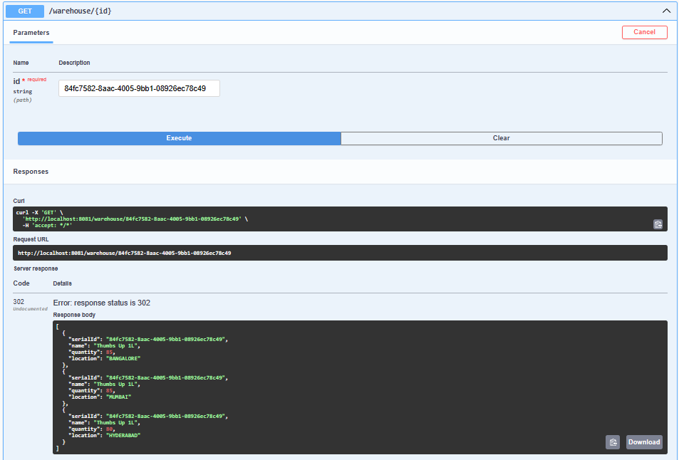

> **Get Request="/warehouse/{location}/{id}" **

Request to get a product details  warehouse details in the table.

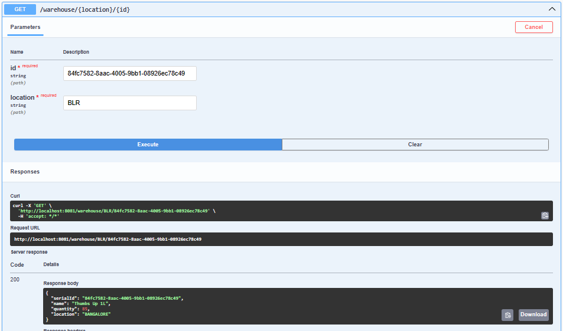

> **Get Request="/warehouse/locations/{location}" **

Request to get all warehouse details in a specific location in the table.

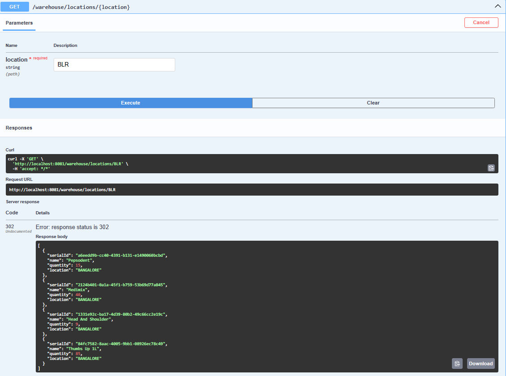

> **Get Request="/warehouse/stock/{location}/{Id}" **

Request to get quantity of a product in a warehouse location in the table.

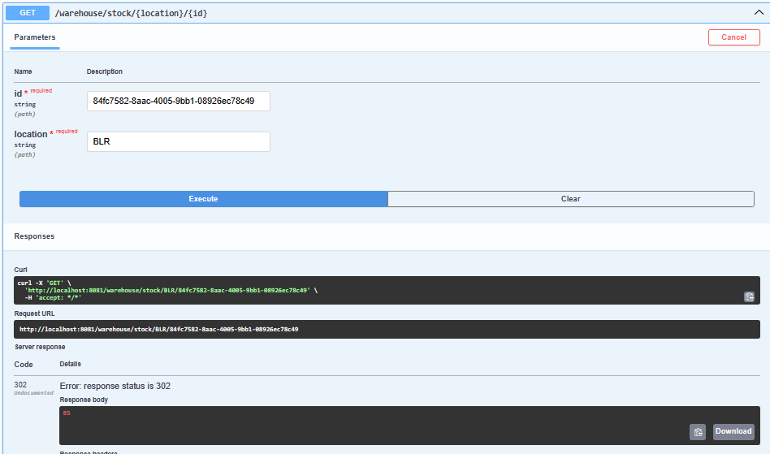

> **Post Request="/warehouse/stock" **

Request to save one warehouse detail in the table.

> **Put Request="/warehouse/{location}/{id}" **

Request to update a warehouse detail in the table.

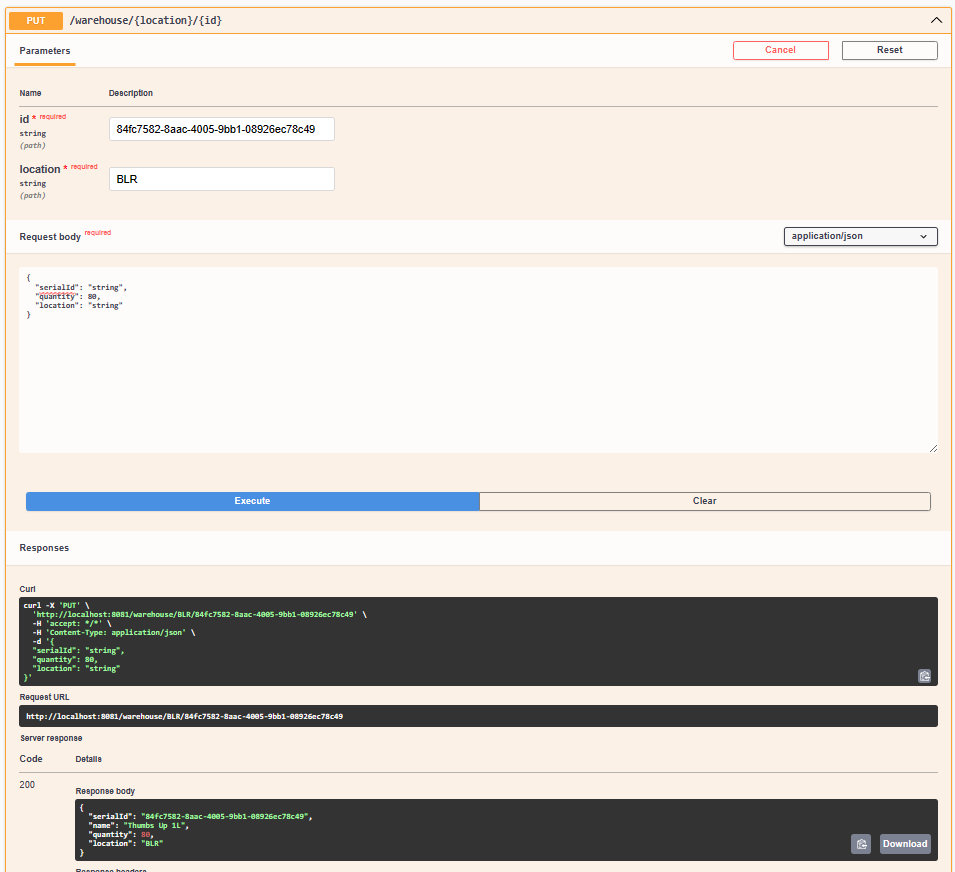

> **Delete Request="/warehouse/{location]/{id}" **

Request to delete a warehouse detail in the table.

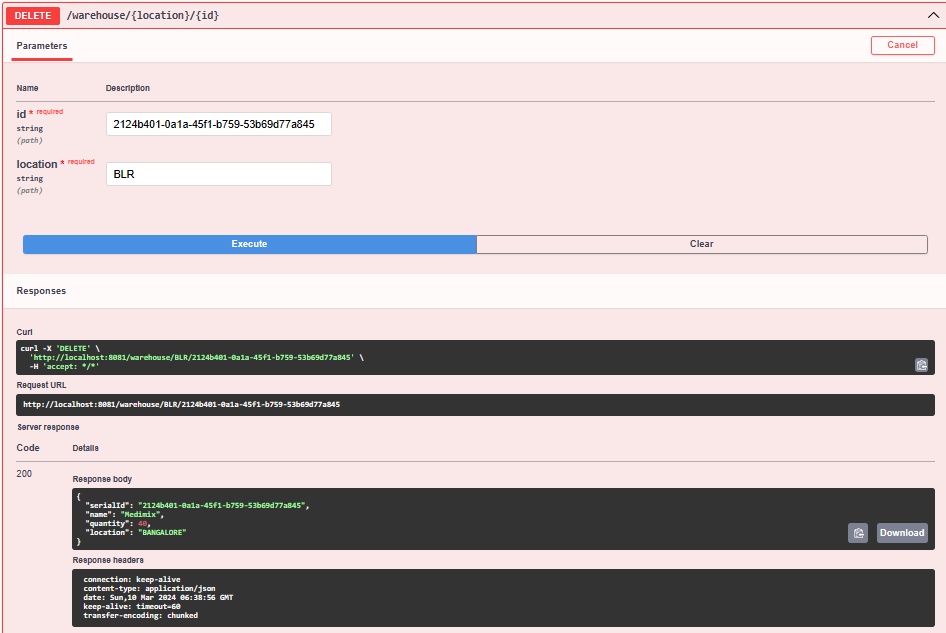

